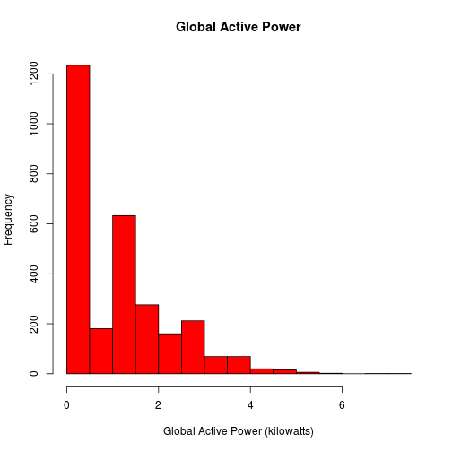
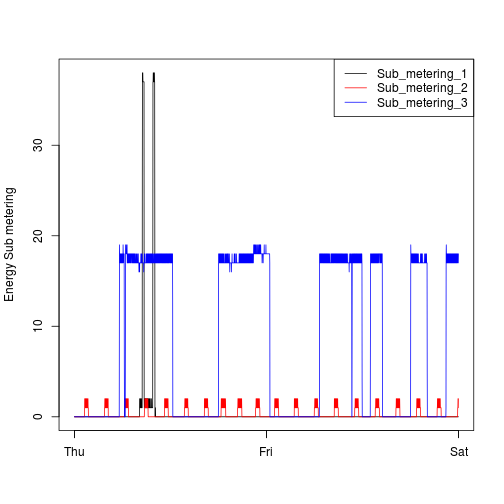
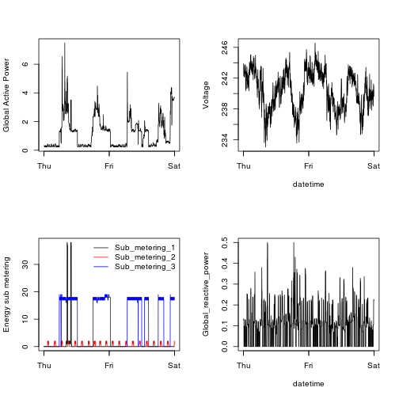

## Introduction

On this repository there are four png files and four R scripts. Each R scripts loads a text file and constructs a plot to a png file. The text file loaded contains data from the <a href="http://archive.ics.uci.edu/ml/">UC Irvine Machine Learning Repository</a>, a popular repository for machine learning datasets. In particular, it has the "Individual household electric power consumption Data Set".  

The plots were constructed using data from the dates 2007-02-01 and 2007-02-02. 

The plots are shown below. 

### Plot 1

 

### Plot 2

 

### Plot 3

 

### Plot 4

 

